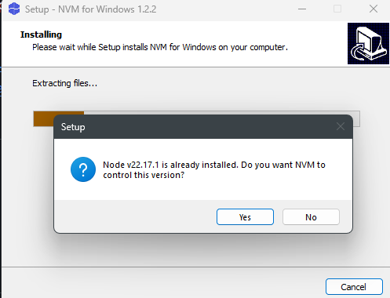
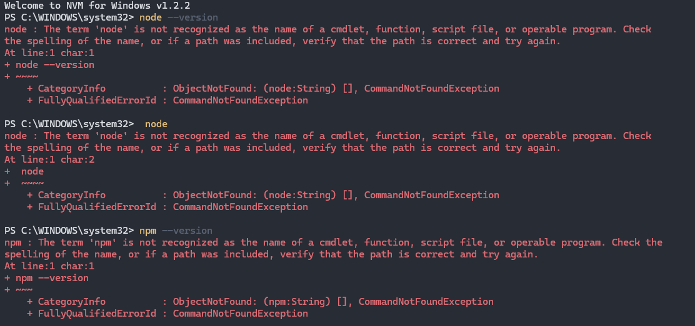

Ecosystem Alternatives:

`dnvm`

`rustup`

`nvm`

Does not support windows due to complexities and issues with Windows.

On Unix:

`nvm-windows`:

The installation location of nvm is `%APPDATA%\nvm` which is a hive containing multiple versions.
The default installation hive is based off of `NVM_SYMLINK`, which contains the location of the symlink file. That symlink is added to the `PATH` behind `NVM_HOME`.

`%APPDATA%\Roaming\npm` contains globally installed tools is above on the PATH.

`NVM_SYMLINK` defaults to `C:\nvm4w\node` -> `use` points it to `...\AppData\Local\nvm\{version}`
`NVM_HOME` defaults to `...\AppData\Local\nvm`. Contains `nvm` itself and its installs.
`NVM_SYMLINK` is used because it enables to `nvm use` to apply to all console windows and can persist upon reboots. However, when running `where npm`, nothing is returned.

Some users report confusion because the symlink cannot point to `C:\Program Files\nodejs`.

`NVM_DIR` is `$HOME/.nvm`.

-> Copies admin installations into the `nvm root`.
Setup does this via a  dialog (UI):

However, it busted my working install at the beginning, including in the window it opened. I had to reopen the terminal for it to work.

-> Suggests you uninstall all admin installations to prevent `PATH` issues.
-> Provides `nvm debug` to debug `PATH` issues.
